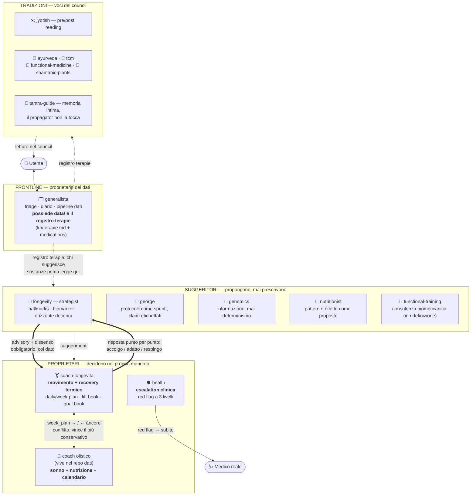

# Wellness Agents

Marketplace di agenti per il benessere integrato — coaching, domini medici
osservazionali e tradizioni (Ayurveda, TCM, medicina funzionale…) — installabili
**uno per uno** come plugin di Claude Code.

Il principio di design: **identità senza memoria**.

- **Qui** vivono le identità degli agenti (chi sono, come ragionano, i loro
  guardrail) e la knowledge generica (cataloghi esercizi, ontologie, protocolli).
- **Nel tuo repo dati privato** vive tutto ciò che riguarda te: profilo, log,
  esami, wearable, memorie che gli agenti accumulano su di te. Niente di
  personale entra mai in questo repository.

Ogni persona compone il proprio consiglio: installa solo gli agenti che vuole
e decide chi partecipa in `config/council.json` del proprio repo dati.

---

## Installazione

### 1. Aggiungi il marketplace

```bash
claude plugin marketplace add fmondora/wellness-agents
```

### 2. Installa i plugin che vuoi

```bash
claude plugin install wellness-core@wellness-agents      # obbligatorio
claude plugin install coach-longevita@wellness-agents    # e gli altri a scelta
```

`wellness-core` è richiesto da tutti gli altri: contiene le convenzioni del
repo dati, il fondamento ontologico e il propagation agent.

### 3. Prepara il tuo repo dati

La via semplice: crea una directory vuota, entra e lancia `/setup` — il
generalista ti guida e crea tutto lui. Oppure a mano:

Gli agenti lavorano nella directory corrente, che deve essere il tuo repo
dati personale (privato, MAI questo repo):

```
mkdir ~/wellness-me && cd ~/wellness-me && git init
mkdir -p data kb memory/agents config
```

Crea `data/profile.json` con l'essenziale (gli agenti ti guideranno a
completarlo):

```json
{ "name": "…", "birth_year": 0, "conditions": [], "medications": [] }
```

e `config/council.json` con chi vuoi al tavolo:

```json
{
  "members": ["functional-medicine", "ayurveda"],
  "pre_reading": null,
  "extra_voices": ["coach-longevita"],
  "output_style": "compact"
}
```

Il layout completo e le regole sono in [`core/CONVENTIONS.md`](core/CONVENTIONS.md).

### 4. Primo uso

Da dentro il tuo repo dati, ad esempio con il coach:

```
/coach-longevita
```

Al primo avvio l'agente fa il **setup una tantum** (12 domande secche su
luoghi, attrezzi, tempi, preferenze, vincoli) e da lì in poi: piano del
giorno, debrief a fine seduta, piano settimanale, review mensile.

### Aggiornamenti

```bash
claude plugin update wellness-agents
```

---

## Plugin disponibili

| Plugin | Categoria | Cosa fa |
|---|---|---|
| `wellness-core` | core | Convenzioni repo dati, fondamento ontologico, propagation agent, /council /ask /propagate — **obbligatorio** |
| `generalista` | frontline | Primo contatto e diario (/log, /telegram): triage, contratto dati, pipeline ingestione (sync wearable, insights, trends) |
| `coach-longevita` | coaching | Training per durare, non per performare: daily/week plan, lift book, debrief obbligatorio, uno skill ginnico alla volta, recovery termico |
| `health` | dominio | Corpo fisico: sintomi, HRV, red flag con escalation — mai diagnosi |
| `nutritionist` | dominio | Pattern alimentari, ricette, obiettivi mai punitivi |
| `longevity` | dominio | Hallmarks dell'aging, forza e VO2max come predittori |
| `functional-training` | dominio | 7 pattern di movimento, HRV come bussola, zone |
| `genomics` | dominio | SNP e pathway dai dati DNA del repo dati — mai determinismo |
| `george` | dominio | Framework reverse aging di @Bluefidel47 — claim etichettati |
| `ayurveda` | tradizione | Dosha, agni, ama, rasayana |
| `tcm` | tradizione | Qi, cinque elementi, pattern di organi, stagionalità |
| `functional-medicine` | tradizione | Root cause, matrice IFM, biomarker di sistema |
| `shamanic-plants` | tradizione | Intelligenza vegetale, adattogeni, dimensione cerimoniale |
| `jyotish` | tradizione | Dasha, transiti, prashna, graha-dhatu, muhurta |
| `tantra-guide` | guida | Kaula: pratica, pratyabhijna, Vigyan Bhairava, spanda |

I job schedulati (launchd/cron) restano nel repo dati dell'utente come shim
sottili che chiamano gli script del plugin `generalista` con `WELLNESS_DATA`
puntato al proprio repo.

---

## Chi decide e chi suggerisce

Gli agenti non sono pari: alcuni **possiedono** un mandato e decidono,
gli altri **suggeriscono** dentro quel mandato. Il generalista è il punto
di passaggio obbligato per i dati della persona.



Le regole del colloquio:

1. **Ogni mandato ha un solo proprietario.** Nessun agente prescrive nel
   mandato di un altro: il movimento è del coach, il sonno e la nutrizione
   del coach olistico, l'escalation di health, i dati del generalista.
2. **I suggeritori etichettano.** Dosaggi, ricette e protocolli escono
   sempre come suggerimenti con fonte (dal corpus, dal database, dal file) —
   mai come prescrizioni, mai dalla memoria del modello.
3. **Il registro terapie prima di tutto.** Chi suggerisce qualsiasi sostanza
   legge prima cosa la persona sta già prendendo (via generalista). Se non
   può leggerlo, non suggerisce sostanze.
4. **Il dissenso è un dovere, non un incidente.** Longevity e coach sono
   twin: lo strategist deve contestare col dato, il coach deve rispondere.
   Il disaccordo non risolto emerge nel council come tensione dichiarata.
5. **Nessuno riscrive i file dell'altro.** Ogni agente scrive solo nel
   proprio spazio (`data/<agente>/`, la propria memoria) e legge il resto.

---

## Altri runtime

Le identità sono markdown neutro; solo il packaging cambia:

- **Grok Build / TUI** — `adapters/grok/install.sh <skills-dir>` materializza
  le skill sostituendo i path del plugin
- **Hermes** — snippet `delegation:` in `adapters/hermes/delegation-example.yaml`

Dettagli in [`adapters/README.md`](adapters/README.md).

---

## Principi non negoziabili

1. **Il repo dati è la persona; il plugin è il sapere.** Mai mescolarli.
2. **Nessun agente diagnostica o prescrive.** Niente farmaci, dosaggi,
   interpretazione di esami come diagnosi. Red flag clinici → medico, subito.
3. **Guardrail identici per tutti**, non configurabili.
4. **Output umano**: le strutture (JSON, schemi) vivono nei file di stato;
   alla persona arriva prosa da coach, non payload.

## Crediti knowledge

- Illustrazioni esercizi: [bryllim/workout-guide](https://github.com/bryllim/workout-guide)
  (MIT / CC BY-SA 4.0, Bryl Lim / Everkinetic)
- Video tecnica movimenti CrossFit: pagine *Essentials* di crossfit.com
  (lista via [bad13/crossfit](https://github.com/bad13/crossfit))
